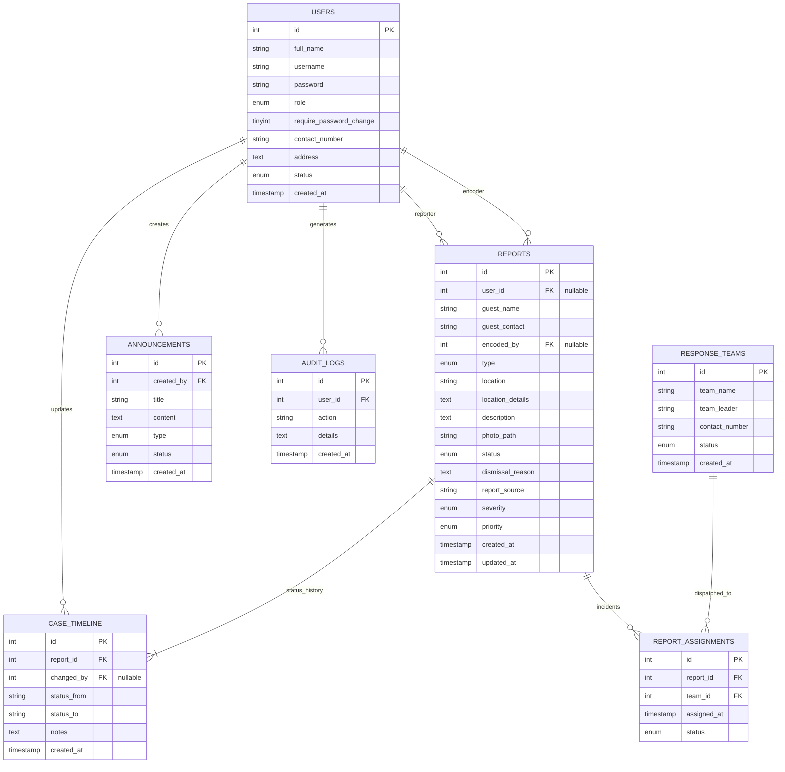
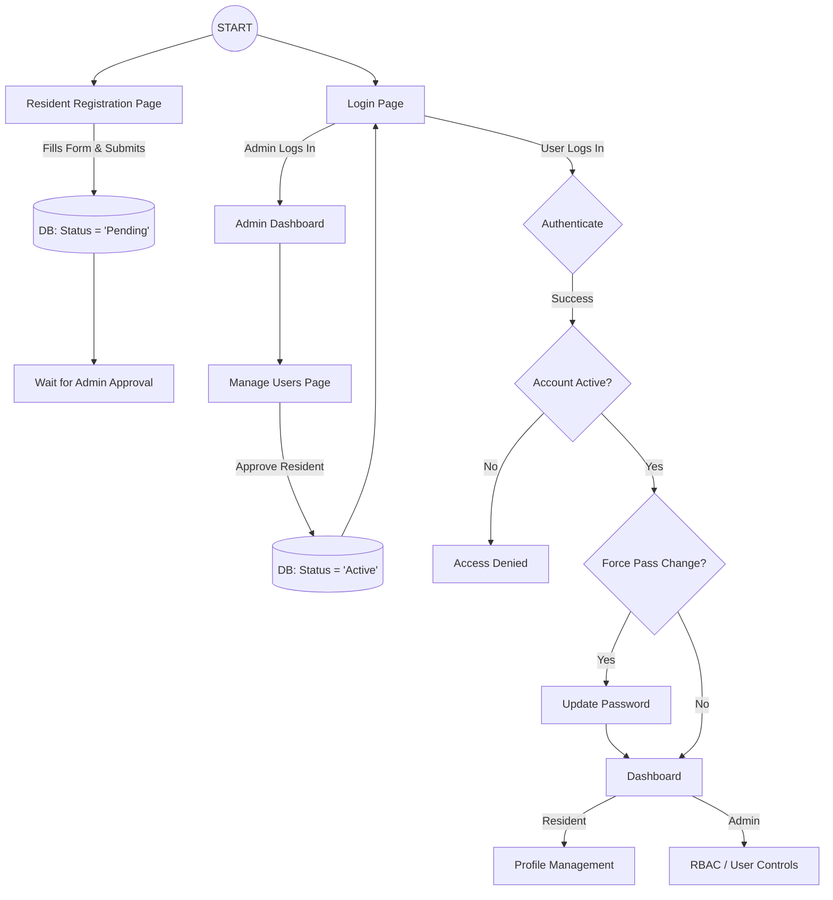
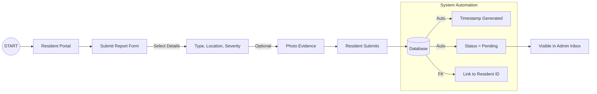

# Flood and Drainage Incident Reporting and Management System
## Slide Deck Content: Technical Documentation

This document contains the core technical components required for your presentation slides.

---

## 🏗️ 1. Entity Relationship Diagram (Crow's Foot)
*Copy this into a mermaid-compatible slide or export as an image. This version includes the "encoded_by" FK and uses 'id' primary keys matching the database.*

---

## 📑 2. Relational Schema (RS)
*Short-hand notation for the database structure.*

*   **Users** (<u>id</u>, full\_name, username, password, role, require\_password\_change, contact\_number, address, status, created\_at)
*   **Response_Teams** (<u>id</u>, team\_name, team\_leader, contact\_number, status, created\_at)
*   **Reports** (<u>id</u>, *user\_id*, guest\_name, guest\_contact, type, location, location\_details, description, photo\_path, status, dismissal\_reason, report\_source, *encoded\_by*, severity, priority, created\_at, updated\_at)
*   **Announcements** (<u>id</u>, title, content, type, status, *created\_by*, created\_at)
*   **Audit_Logs** (<u>id</u>, *user\_id*, action, details, created\_at)
*   **Case_Timeline** (<u>id</u>, *report\_id*, status\_from, status\_to, *changed\_by*, notes, created\_at)
*   **Report_Assignments** (<u>id</u>, *report\_id*, *team\_id*, assigned\_at, status)

---

## 📖 3. Data Dictionary
| Table | Primary Key | Foreign Keys | Key Attributes |
| :--- | :--- | :--- | :--- |
| **Users** | `id` | - | `role`, `status`, `require_password_change` |
| **Reports** | `id` | `user_id`, `encoded_by` | `type`, `location`, `status`, `severity`, `report_source` |
| **Response Teams** | `id` | - | `team_name`, `team_leader`, `status` (Automated) |
| **Assignments** | `id`| `report_id`, `team_id` | `status` (Assigned, On Site, Completed) |
| **Timeline** | `id`| `report_id`, `changed_by` | `status_from`, `status_to`, `notes` |
| **Announcements** | `id`| `created_by` | `type`, `status` |
| **Audit Logs** | `id`| `user_id` | `action`, `details` |

---

## 🐚 4. Visual UX User Flow: User Management
*This diagram covers registration, admin approval, and the forced password change security gate.*

---

## 🌊 5. Visual UX User Flow: Incident Reporting
*Captures the resident reporting process and automated system reactions.*

