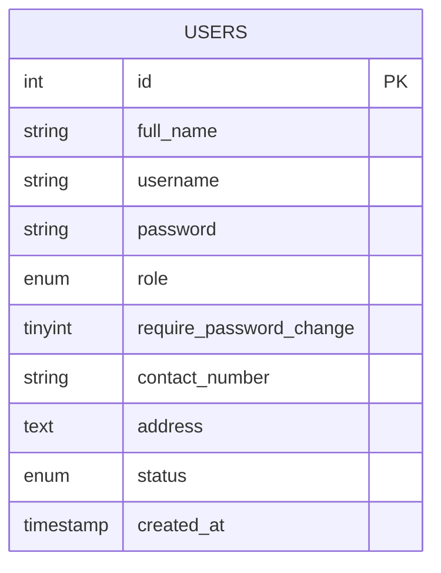
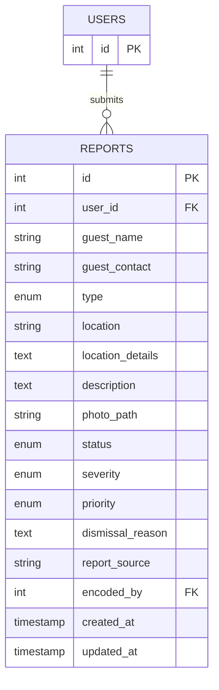
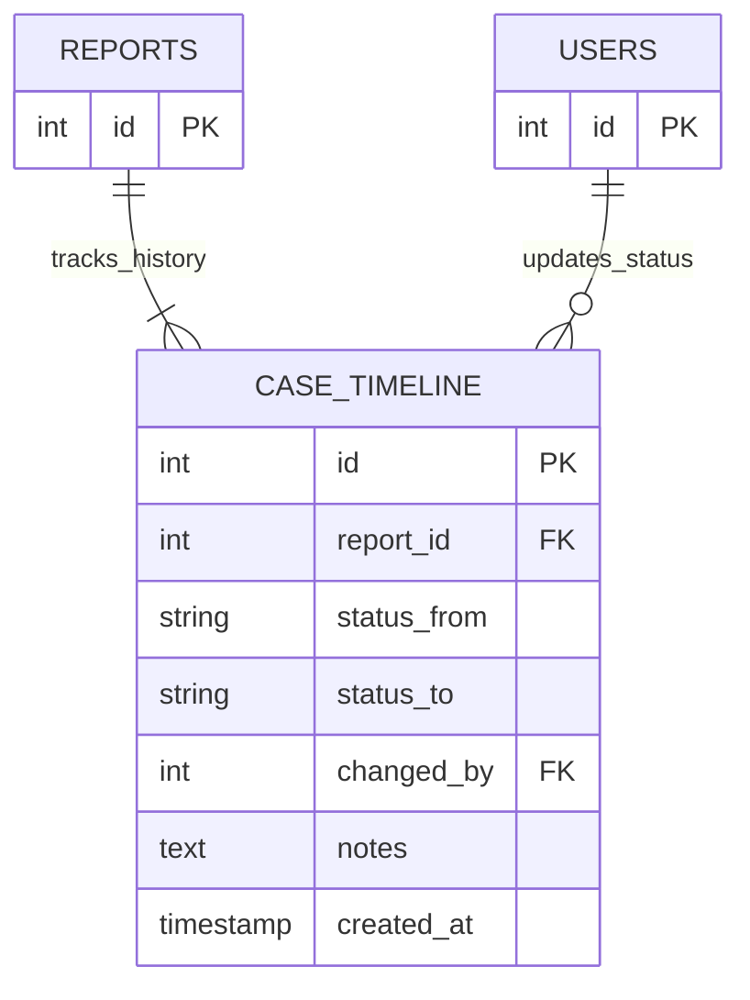
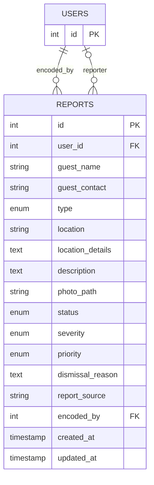
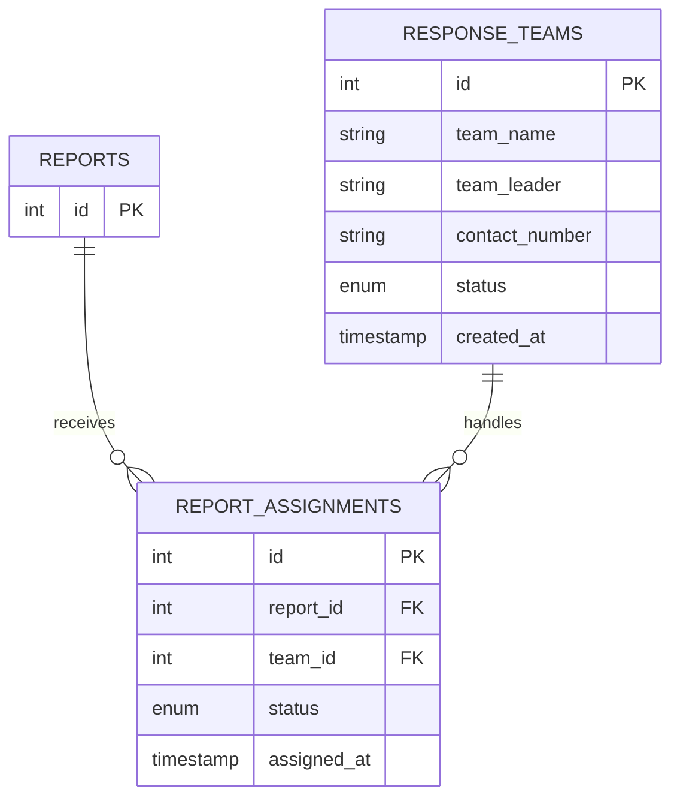
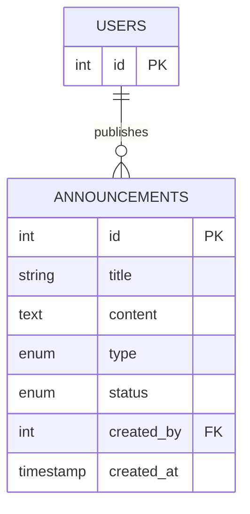
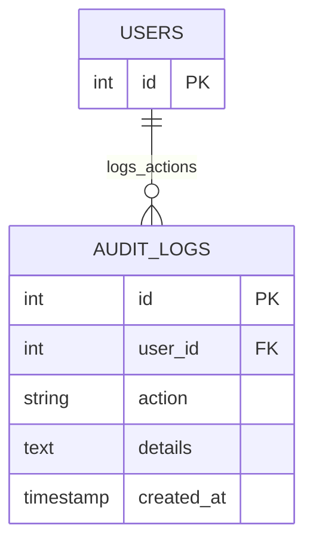
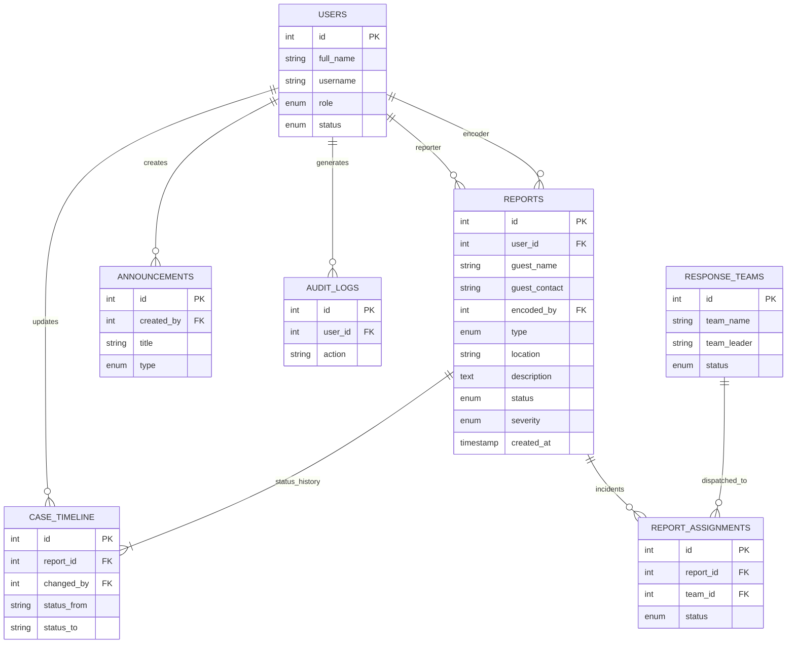

# Flood and Drainage Incident Reporting and Management System
## 🏗️ Module-Based Entity Relationship Diagrams (ERD)

This document provides the technical ERD for each system module using **Crow's Foot Notation**, strictly mapped from the current `database.sql` schema using 'id' as the primary key.

---

### 1. User Management Module
Focuses on the core `users` entity for identity and permission control.

---

### 2. Incident Reporting Module
The flow of incidents submitted by residents.

---

### 3. Advanced Report Management Module
Tracking the lifecycle and transition history of incidents.

---

### 4. Manual Report Encoding Module
Administrative logging of walk-in or offline incidents.

---

### 5. Response Team Management Module
Dispatching resources to handle reported emergencies.

---

### 6. Communication and Advisory Module
The administrative broadcasting system.

---

### 7. System Intelligence and Auditing Module
Monitoring administrative integrity and data trends.

---

### 🏛️ Consolidated System ERD

