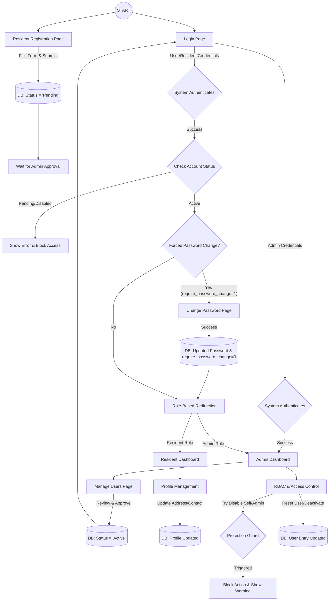
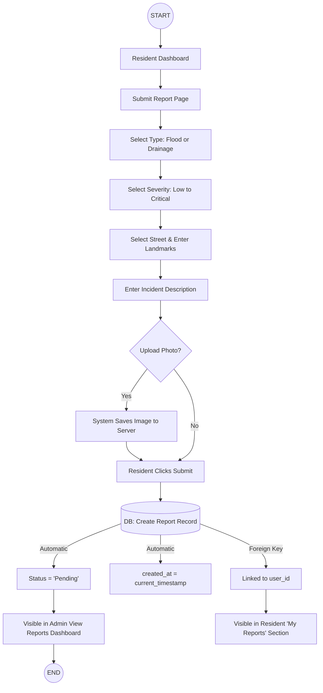

# User Management Module: UX User Flow

This diagram illustrates the end-to-end journey of a user within the management system, from initial registration to administrative control and security protocols.

### Key Logic Highlights
1.  **Account Lifecycle**: Every online registration begins as `Pending` and must pass through an Administrative manual audit before becoming `Active`.
2.  **Security Gatekeeping**: The system automatically checks for the `require_password_change` flag upon every login attempt, ensuring that temporary or admin-reset passwords are changed immediately.
3.  **Administrative Protection**: Built-in logical guards prevent the "self-lockout" scenario where an admin might accidentally disable their own account or other critical admin staff.
4.  **Role-Based Access Control (RBAC)**: Authentication leads to a fork in the flow where the user is strictly routed to either the Resident Portal or the Command Center (Admin Panel) based on their database-assigned role.

---

## Incident Reporting Module: UX User Flow

This flow maps the process of a resident providing visual and descriptive information about a community hazard and how that data enters the system's administrative workflow.

### Key Logic Highlights
1.  **Guided Entry**: The user interface uses structured dropdowns (Type, Severity, Street) to ensure data is clean and easier for the Admin to filter later.
2.  **Media Integration**: While photo evidence is optional to lower the barrier for quick reporting, the system handles the physical file storage and database path linking automatically if provided.
3.  **Automated Integrity**: The resident doesn't need to enter the time; the system guarantees accuracy by generating the `created_at` timestamp at the exact moment of database insertion.
4.  **Instant Visibility**: Through Relational Mapping (Foreign Keys), the report is instantly available to both the user (for tracking) and the Administrator (for emergency response).
